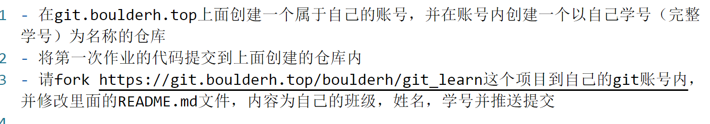

---
toc:
  depth_from: 1
  depth_to: 6
  ordered: false
---
[toc]

这是一条笔记内容
# 标题1
## 标题2
### 标题3
#### 标题4

- 选项1
- 选项2
- 选项3

1. 有序1
2. 有序2
3. 有序3

``` c
#include <stdio.h>
int main(void)
{
    printf("Hello,C!");
    return 0;
}
```

``` bash
read var
echo ${var}
```

``` python {.line-numbers}
def func(num:int) -> None:
    return num**3

print(func(100))
```




==[python官网](https://www.python.org)==


正如 Kanye West 所说：

> We're living the future so
> the present is our past.


- [x] @mentions, #refs, [links](), **formatting**, and <del>tags</del> supported
- [x] list syntax required (any unordered or ordered list supported)
- [x] this is a complete item
- [ ] this is an incomplete item

:smile:
:fa-car:
:cry:
:tiger:

@import "main.py"
